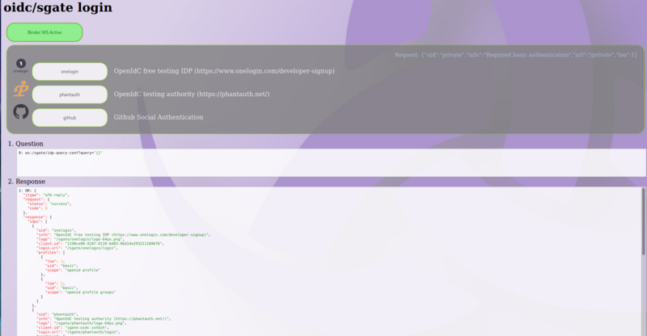
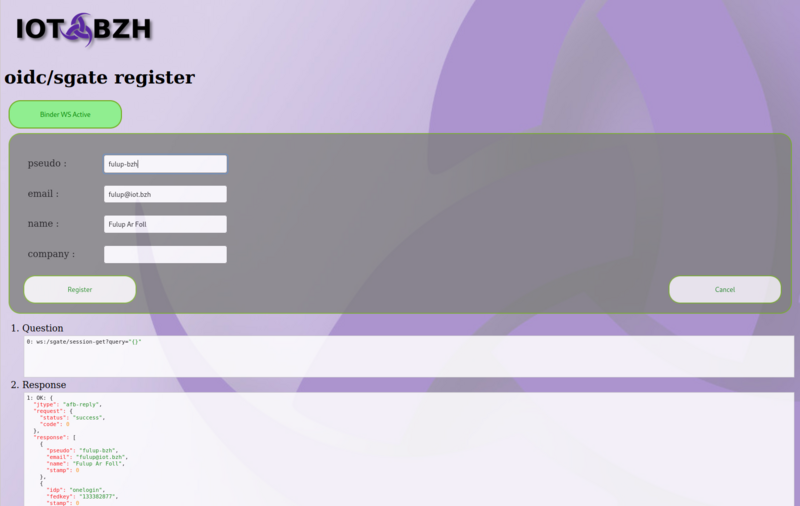
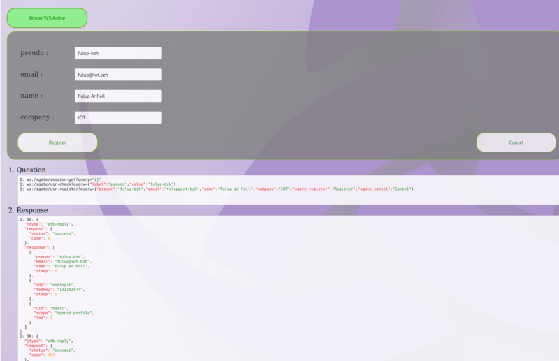

# API sgate

sgate support following API. Api are defined within oidc-svc.c source file.

```C
static afb_verb_t idsvcVerbs[] = {
    /* VERB'S NAME         FUNCTION TO CALL         SHORT DESCRIPTION */
    {.verb = "ping",.callback = idsvcPing,.info = "ping test"},
    {.verb = "url-query-conf",.callback = urlQuery,.info = "wreq wellknown url list/tag"},
    {.verb = "idp-query-conf",.callback = idpQueryConf,.info = "wreq idp list/scope for a given LOA level"},
    {.verb = "idp-query-user",.callback = idpQueryUser,.info = "return pseudo/email idps list before linking user multiple IDPs"},
    {.verb = "session-get",.callback = sessionGet,.info = "retrieve current client session [profile, user, social]"},
    {.verb = "session-event",.callback = subscribeEvent,.info = "subscribe to sgate private client session events"},
    {.verb = "session-reset",.callback = sessionReset,.info = "reset current session [set loa=0]"},
    {.verb = "usr-register",.callback = userRegister,.info = "register federated user profile into local fedid store"},
    {.verb = "usr-check",.callback = userCheckAttr,.info = "check user attribute within local store"},
    {.verb = "usr-federate",.callback = userFederate,.info = "request federating current user with an other existing IDP"},
    {NULL} // terminator
};
```

## ping

Simple command to check if binding and API is responding.

Question:
```json
    ws:/sgate/ping?query={}
```
Response:
```json
{
  "jtype": "afb-reply",
  "request": {
    "status": "success",
    "code": 0
  },
  "response": "Pong=0"
}
```

## idp-query-conf

Return the list of configured IDP matching requested LOA with all necessary information for presenting a login UI to the end-user. This returns any IDP with an LOA greater or equal to requested LOA.

```json
// request
    ws:/sgate/idp-query-conf?query="{'loa':1}"
```

The API return IDPs list to present to end-user as well as the alias that requested the permission.
```json
// response
  "jtype": "afb-reply",
  "request": {
    "status": "success",
    "code": 0
  },
  "response": {
    "idps": [
      {
        "uid": "onelogin",
        "info": "OpenIdC free testing IDP (https://www.onelogin.com/developer-signup)",
        "logo": "/sgate/onelogin/logo-64px.png",
        "client-id": "1198ce80-9187-0139-6d83-06d14e293211189676",
        "login-url": "/sgate/onelogin/login",
        "profiles": [
          {
            "loa": 1,
            "uid": "basic",
            "scope": "openid profile"
          },
          {
            "loa": 2,
            "uid": "basic",
            "scope": "openid profile groups"
          }
        ]
      },
      {
        "uid": "phantauth",
        //....
      }
    ],
    "alias": {
      "uid": "private",
      "info": "Required basic authentication",
      "url": "/private",
      "loa": 1
    }
  }
}
```



## idp-query-usr

Return the list of IDP used by an existing user. This API is used to link two federated accounts.

```json
// request
    ws:/sgate/idp-query-conf?query="{'pseudo':'xxxx', email=:'xxxx'}"
```

The API return IDPs list to present to end-user as well as the alias that requested the permission.
```json
// response
  "jtype": "afb-reply",
  "request": {
    "status": "success",
    "code": 0
  },
  "response": {
    "idps": [
      {
        "uid": "onelogin",
        "info": "OpenIdC free testing IDP (https://www.onelogin.com/developer-signup)",
        "logo": "/sgate/onelogin/logo-64px.png",
        "client-id": "1198ce80-9187-0139-6d83-06d14e293211189676",
        "login-url": "/sgate/onelogin/login",
        "profiles": [
          {
            "loa": 1,
            "uid": "basic",
            "scope": "openid profile"
          },
          {
            "loa": 2,
            "uid": "basic",
            "scope": "openid profile groups"
          }
        ]
      },
      {
        //....
      }
    ],
  }
}
```

## session-get

Return current session cookies values as a json array
* 1st contains federated user as returned from the IDP user info service. The content of this may vary depending on IDP requested scope and are typically what is presented to user for initial provisioning.
* 2nd contains social identity at the idp side, the two potentially useful pieces of information are: idp->uid and the idp->fedkey.
* 3rd contains use authentication profile. It contains the requested scope and the attached loa.

Question
```json
    ws:/sgate/session-get?query="{}"
```
Response
```
1: OK: {
  "jtype": "afb-reply",
  "request": {
    "status": "success",
    "code": 0
  },
  "response": [
    {
      "pseudo": "fulup-bzh",
      "email": "fulup@iot.bzh",
      "name": "Fulup Ar Foll",
      "stamp": 0
    },
    {
      "idp": "onelogin",
      "fedkey": "133382877",
      "stamp": 0
    },
    {
      "uid": "basic",
      "scope": "openid profile",
      "loa": 1
    }
  ]
}
```



## session-reset

Reset session LOA to zero (public access) and return config sgate globals urls. Client UI is responsible to the end-user to adequate HTML page (usually 'home' or 'login').

Question:
```json
ws:/sgate/session-reset?query={}
```
Response:
```json
 {
  "jtype": "afb-reply",
  "request": {
    "status": "success",
    "code": 0
  },
  "response": {
    "home": "/",
    "login": "/sgate/common/login.html",
    "error": "/sgate/common/error.html"
  }
}
```


## session-event

Subscribe to sgate notification event. A new event is generated each time a privilege is refused or a session reset. It is the responsibility of client UI to process these events, and generate an adequate authentication request to provide requested privileges.

Question:
```json
    ws:/sgate/session-event?query={}
```
Response:
```json
 {
  "jtype": "afb-reply",
  "request": {
    "status": "success",
    "code": 0
  }
}
```

## usr-check

Check if a user attribute is already present in the database federated user store. Technically this request is processed by fedid binding. Response is either 'available' when not present or 'locked' if already present in base.

Question:
```json
    ws:/sgate/usr-check?query={"label":"pseudo","value":"fulup-bzh"}
    ws:/sgate/usr-check?query={"label":"email","value":"fulup@iot.bzh"}
```

Response
```
{
  "jtype": "afb-reply",
  "request": {
    "status": "success",
    "code": 407
  },
  "response": "available"
}
```

## usr-register

Register a new user if email/pseudo are available. The response when successful includes a target where UI should redirect the end-user. When pseudo/user already exists usr-registers fail with an error status, in this case application should try usr-federate api.

Question:
```json
    ws:/sgate/usr-register?query={"pseudo":"fulup-bzh","email":"fulup@iot.bzh","name":"Fulup Ar Foll","company":"IOT","sgate_register":"Register","sgate_cancel":"Cancel"}
```

Response:
```json
{
  "jtype": "afb-reply",
  "request": {
    "status": "success",
    "code": 0
  },
  "response": {
    "target": "/private"
  }
}
```


## usr-federate

When a user email/pseudo is already used within federated dbstore both social idp accounts need to be linked. In order to initiate account federation linking, UI should call usr-federate api. This API prepares federation and notifies UI where to go to prove ownership of both social accounts and return the target HTML page where the user should be redirected.

Question:
```json
    ws:/sgate/usr-federate?query={"pseudo":"fulup-bzh","email":"fulup@iot.bzh","name":"Fulup Ar Foll","company":"IOT","sgate_register":"Federate","sgate_cancel":"Cancel"}
```

```response
{
  "jtype": "afb-reply",
  "request": {
    "status": "success",
    "code": 0
  },
  "response": {
    "target": "/sgate/common/fedlink.html"
  }
}
```
