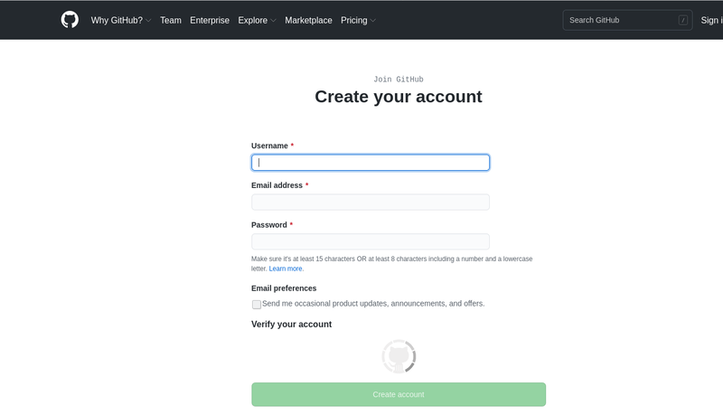
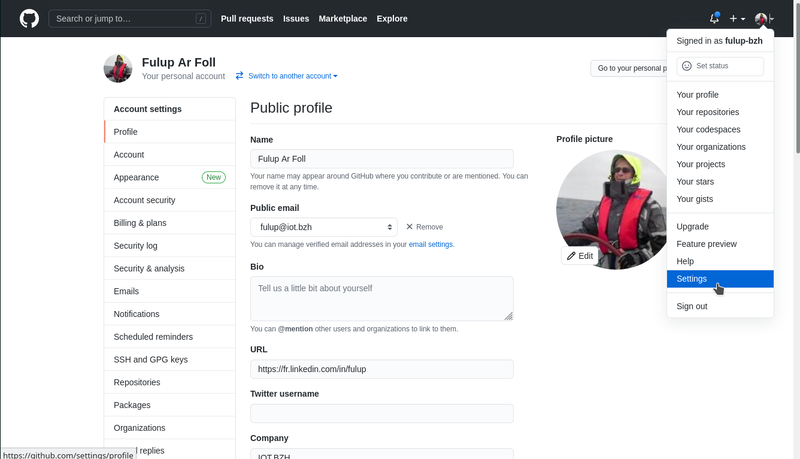
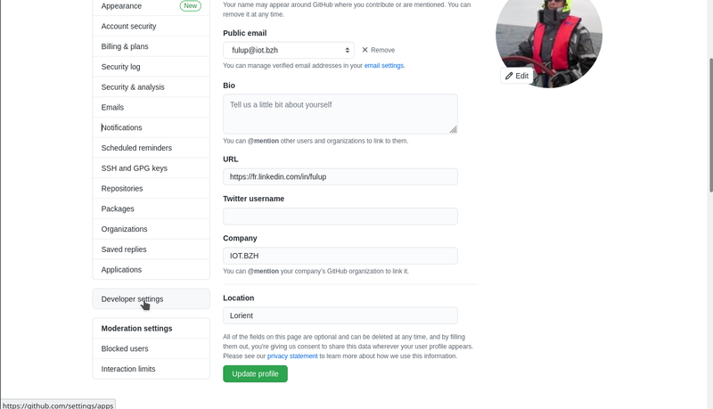
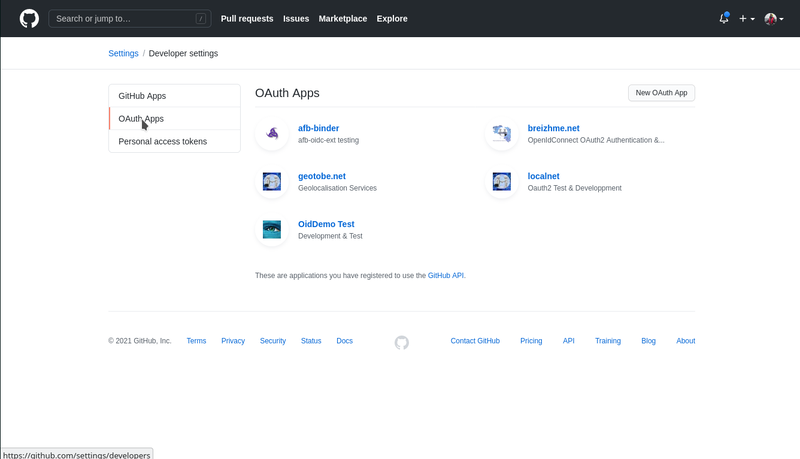
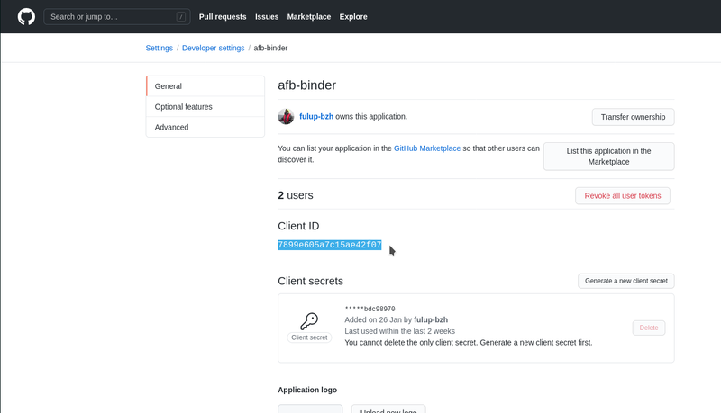

# github Quick start IDP configuration

github is not openid-connect compliant but proposes similar functionality on base of oAuth2. The main advantage of Github is that every developer on the planet already has an account, and the admin work to add a new application remains simple and 100% free, even when going from development phase to production.

## 1- request a developer account.

As everyone should already have an account, I suppose that we should replace this chapter title with "log on with your existing github account".



## 2- get your application client-id

On order to get a client-id for your application, you should

* select the 'settings' menu from user profile menu (top right)
* select again 'settings' but this time from developer section bottom left menu
* select 'OAauth' apps
* finally create your application.





## 3- register your login url

In order your redirected login is accepted by github IDP, the url from your static config should match with the one you register at github. Note that github does not care about your application port, but does about hostname.

```json
    "statics": {
        "login": "/sgate/github/login",
        "logo": "/sgate/github/logo-64px.png",
    }
```

Note:

* application login uri should also be declared within the IDP static section of your sgate config in such a way that internal alias and external url match. The login redirect is not an HTML page as such, but a GET/POST endpoint automatically created by sgate and thus does not require a dedicated alias. On the other hand 'logo' is a real url and depending on your config may require an alias.

* redirect login url should be a valid url for your browser, it does not have to be valid for github idp. As a result https://localhost or https://my.target.local are perfectly acceptable. Github does not impose any constraints on redirect url, you may use http/https. Furthermore your application port (i.e. 1234) does not need to be registered on the admin console and github will just redirect you to the same port as the one asking the question.

* redirect logout is not supported by github.


## 4- retrieve application clientid/secret

As soon as your application is created under github admin console, your may retrieve its clientid/secret from 'setting/developerSettings/app-name' page. Clientid and secret should be copied into the credentials section of your sgate config.

When this is done you should be able to login with openid-connect and github.

```json
    "credentials": {
        "clientid": "7899e605a7c15ae42f07",
        "secret": "*****bdc98970"
    },
```


## 5- Add users

you do not have to add user, any github user may sign with his own account on your newly created application.

## 6- mapping role on sgate security attributes

Github does not support neither user groups nor roles. In order to by this limit, you may map github 'organizations, repositories, ...' as sgate security attributs. For this you only have to declare which github profile end point you choose as security attributes provider.

```json
    "profiles": [
        {"uid":"basic", "loa":1, "scope":"user:email"},
        {"uid":"teams", "loa":2, "scope":"read:org", "attrs":"organizations_url"}
    ]
```
Hereafter an extract of gibhub developer documentation, a full list of github endpoint [here](https://docs.github.com/en/rest/reference/users) Depending on requesting roles those urls are returned as part of user profile after authentication
```json
  "followers_url": "https://api.github.com/users/octocat/followers",
  "following_url": "https://api.github.com/users/octocat/following{/other_user}",
  "gists_url": "https://api.github.com/users/octocat/gists{/gist_id}",
  "starred_url": "https://api.github.com/users/octocat/starred{/owner}{/repo}",
  "subscriptions_url": "https://api.github.com/users/octocat/subscriptions",
  "organizations_url": "https://api.github.com/users/octocat/orgs",
  "repos_url": "https://api.github.com/users/octocat/repos",
  "events_url": "https://api.github.com/users/octocat/events{/privacy}",
  "received_events_url": "https://api.github.com/users/octocat/received_events",
```

## 7 Minimalist github config.

A minimalist configuration may look like the following one. Check for config chapter for full config options.

```json
{
  "name": "afb-oidc",
  "rootdir":  "/my/sgate/rootdir",
  "https": true,
  "https-cert": "./project/ssl/devel-cert.pem",
  "https-key": "./project/ssl/devel-key.pem",
  "extension": "libafb-sec-gate-oidc-ext.so",
  "binding" : [{"uid": "fedid-api", "path": "fedid-binding.so"}],

  "@extconfig": {
    "sec-gate-oidc": {
        "api": "sgate",
        "globals": {
            "login": "/sgate/common/login.html",
            "register": "/sgate/common/register.html",
            "fedlink": "/sgate/common/fedlink.html",
            "error": "/sgate/common/error.html",
        },

        "idps": {
            "uid": "github",
            "info": "Github Social Authentication",
            "credentials": {
            "clientid": "my-github-app-clientid",
            "secret": "my-github-app-secret",
            },

            "statics": {
                "login": "/sgate/github/login",
                "logo": "/sgate/github/logo-64px.png",
            },
            "profiles": [
                {"uid":"basic", "loa":1, "scope":"user:email"},
                {"uid":"teams", "loa":2, "scope":"read:org", "attrs":"organizations_url"}
            ],
        },
        "alias": [
            {"uid": "idp-github"  , "url":"/sgate/github","loa":0, "path":"idps/github" },
            {"uid": "public" , "url":"/public", "path":"public" },
            {"uid": "private", "url":"/private",  "loa":1, "path":"private" },
            {"uid": "confidential", "url":"/confidential", "loa":2, "path":"confidential" },
        ]
    }
  }
}
```
