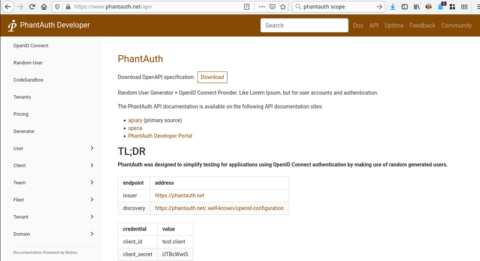
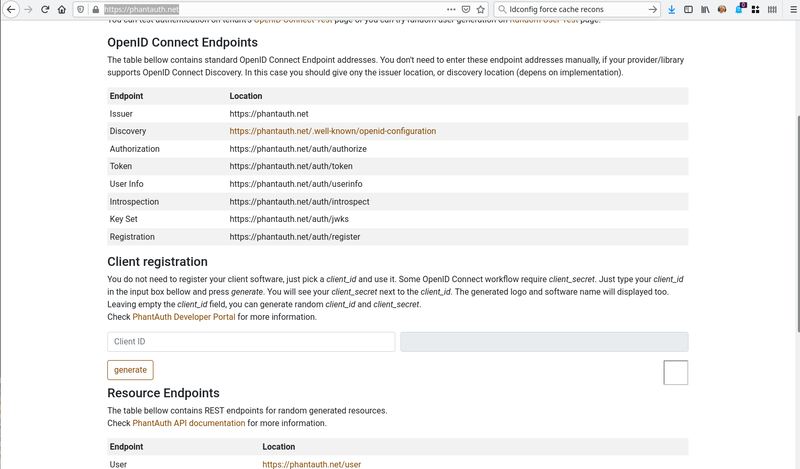
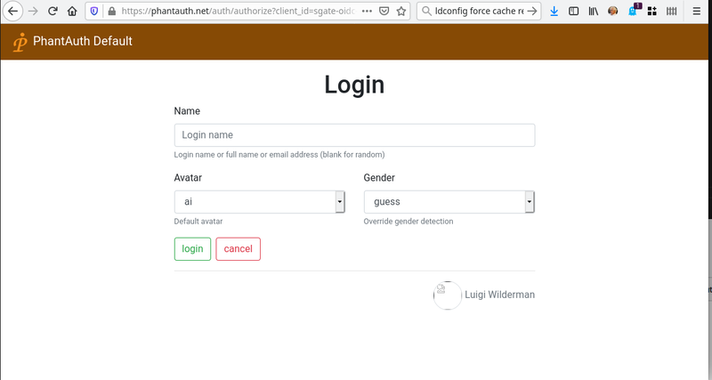

# phantauth Quick start IDP configuration

phantauth is not a readl IDP, but more a tool for openid-connect client test and certification. It hardly requires configuration and might be very convenient for your CI/QA testing environment.

Note that Phantauth provides a quite complete set od REST api to automate your CI testing scenario. Check API documentation [here](https://www.phantauth.net/api/)



## 1- request a developer account.

Phantauth is fully opensource, and no registration is required. This does not prevent you from giving a small donation to cover operation costs [pricing](https://www.phantauth.net/doc/#pricing)

## 2- get your application client-id

Phantauth allows you to use any random client-id. Simply generate a secret [here](https://www.phantauth.net/)



## 3- register your login url

No need to register your redirect_uri, any one will do the job. This being said, you still need a valid end point to accept redirect after a valid authentication.

```json
    "statics": {
        "login": "/sgate/phantauth/login",
        "logo": "/sgate/phantauth/logo-64px.png",
    }
```

## 4- Add users

No need to request a user. Phantauth provides a fake login with no password. At login time user may choose its own attributes.




## 6- mapping role on sgate security attributes

Phantauth does not handle groups/roles as such. Nevertheless for testing purposes you may still use gender or order other attributes as fake security attributes.

For this, create a profile that requests corresponding identity attributes. Available scope [here](https://www.phantauth.net/doc/integration#scope)

```json

    "profiles": [
        {"uid":"basic", "loa":1, "scope":"openid profile"},
        {"uid":"basic", "loa":2, "scope":"openid profile address"}
    ]

```

Then map one of the return keys from JWT token_id as sgate security attribute.

```json
    "schema": {
        "attrs": "address",
    },
```

## 7 Minimalist phantauth config.

A minimalist configuration may look like the following one. Check for config chapter for full config options.

```json
{
  "name": "afb-oidc",
  "rootdir":  "/my/sgate/rootdir",
  "https": true,
  "https-cert": "./project/ssl/devel-cert.pem",
  "https-key": "./project/ssl/devel-key.pem",
  "extension": "libafb-sec-gate-oidc-ext.so",
  "binding" : [{"uid": "fedid-api", "path": "fedid-binding.so"}],

  "@extconfig": {
    "sec-gate-oidc": {
        "api": "sgate",
        "globals": {
            "login": "/sgate/common/login.html",
            "register": "/sgate/common/register.html",
            "fedlink": "/sgate/common/fedlink.html",
            "error": "/sgate/common/error.html",
        },

        "idps": [{
        {
            "uid": "phantauth",
            "type": "oidc",
            "credentials": {
                "clientid": "sec-gate-oidc-iotbzh",
                "secret": "3ON5yAxX",
            },
            "wellknown": {
                "discovery": "https://www.phantauth.net/.well-known/openid-configuration",
            },
            "statics": {
                "login": "/sgate/phantauth/login",
                "logo": "/sgate/phantauth/logo-64px.png",
                "timeout": 600
            },
            "profiles": [
                {"uid":"basic", "loa":1, "scope":"openid profile"},
            ]
        }],

        "alias": [
            {"uid": "idp-phantauth" , "url":"/sgate/onlogin", "path":"idps/phantauth" },

            {"uid": "public" , "url":"/public", "path":"public" },
            {"uid": "private", "url":"/private",  "loa":1, "path":"private" },
            {"uid": "confidential", "url":"/confidential", "loa":2, "path":"confidential" },
        ]
    }
  }
}
```
