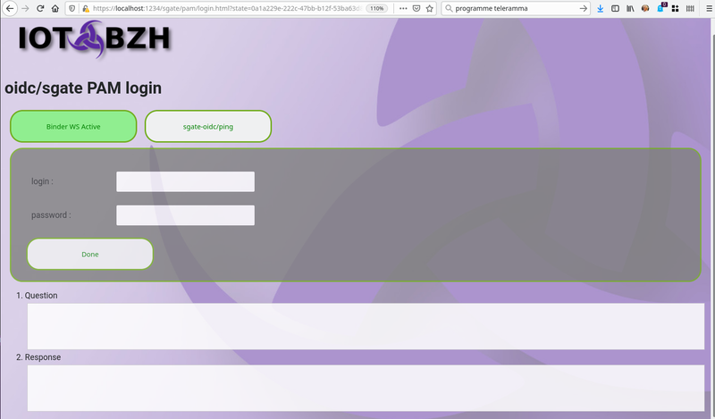

# pam Quick start IDP configuration

PAM is obviously not openid-connect compliant. Like for LDAP sgate fakes an IDP. With pam sgate map /etc/passwd uid as a federated user ID and use GIDS as security attributes.

Standard PAM login does not support SSO(Sign Sign On) and each time a session timeouts, you will have to confirm your password.

Note that pam is implemented as an external IDP plugin and should may be use as a template to interface with any other non standard authority.

## 1- request a developer account.

While requesting a PAM developer account does is obviously out of scope. You will nevertheless need the root account to:

* add new sgate users (UID >= 1000)
* give /etc/shadow read access to sgate process.

For this you may use following commands:

```bash
    # add a new user with 'admin,devel,..' security attributes
    sudo useradd -m username -d /var/tmp -u 2000 -g users -G admin,devel,...

    # give /etc/shadow read access to sgate process
    sudo groupadd -f -r shadow
    sudo chmod shadow /etc/shadow
    sudo chmod g+r /etc/shadow
    sudo usermod -a -G shadow user-running-sgate-process
```

## 2- get your application client-id

pam does not use application client-id or schema. Nevertheless it is an external plugin and config should known where to find it.


```json
    "plugin": {
        "ldpath": "./package/lib/plugins/libidp-sgate-pam-auth.so:/usr/local/afb-oidc/lib/libidp-sgate-pam-auth.so",
        "gids":16,
        "uidmin": 100
    },
```

* **ldpath**: where to load the plugin from. Note that providing search path is optional if plugin is reachable via ldconfig.
* **gids**: gids is the maximum number of group allows for a given user. When GIGS exist they are mapped as sgate security attributes. If this number is too small, an error is logged and no security attributes get loaded. (default 32)
* **uidmin**: minimum uid to propose for login, in order to exclude system user from possible selection. (default 1000)
* **avatar**: default pam user avatar. (default: /sgate/pam/avatar-dflt.png)

## 3- register your login url

Like for LDAP, they is not need to register a login URL, default should work for most of developers. Furthermore it is recommended to use websocket over a get/post form to check a login/passwd. The logo is the logo that should be display to help user to select the right authentication authority.

```json
    "statics": {
        "login": "/sgate/pam/login",
        "logo": "/sgate/pam/logo-64px.png",
    }
```

## 4- retrieve application clientid/secret

There is no clientid/secret the credential section is unused. On the other hand as pam does not provide an authentication page, you should provide one and register it within the wellknown section.

```json
    "wellknown": {
        "tokenid": "/sgate/pam/login.html"
    },
```

This page should request user login/password and either post it back to the same uri end point, or better as explained before use the websocket API to check login/password validity. Check sample pam login page at $SOURCE/conf.d/project/htdocs/idps/pam/login.html




## 5- Add users

Any user >= uidmin having pam 'login' capability  should be able to access sgate login.

## 6- mapping role on sgate security attributes

Any group present for user within /etc/groups are automatically used as sgate security attributes.

**NOTE**: PAM uses profile 'scope' to map /etc/pam.d applications. With the scope 'login' you /etc/pam.d/login should be present. Feel free to configure PAM to match your authentication constrain to reach higher level of LOA(Level Of Assurance) with something more secure than login/password. (i.e NFS reader, PKI, ...)

```json
    "profiles": [
            {"uid":"login", "loa":1, "scope":"login"}
    ]
```

Further information on PAM service module [here](https://access.redhat.com/documentation/en-us/red_hat_enterprise_linux/6/html/managing_smart_cards/creating_pam_modules)


## 7 Minimalist pam config.

A minimalist configuration may look like following one. Check for config chapter for full config options.

```json
{
  "name": "afb-oidc",
  "rootdir":  "/my/sgate/rootdir",
  "https": true,
  "https-cert": "./project/ssl/devel-cert.pem",
  "https-key": "./project/ssl/devel-key.pem",
  "extension": "libafb-sec-gate-oidc-ext.so",
  "binding" : [{"uid": "fedid-api", "path": "fedid-binding.so"}],

  "@extconfig": {
    "sec-gate-oidc": {
        "api": "sgate",
        "globals": {
            "login": "/sgate/common/login.html",
            "register": "/sgate/common/register.html",
            "fedlink": "/sgate/common/fedlink.html",
            "error": "/sgate/common/error.html",
        },

        "idps": {
            "uid": "pam",
            "plugin": {
              "ldpath": "libidp-sgate-pam-auth.so",
            },
            "statics": {
                "login": "/sgate/pam/login",
                "logo": "/sgate/pam/logo-64px.png",
            },
            "profiles": [
                {"uid":"login", "loa":1, "scope":"login"}
            ]
        },

        "alias": [
            {"uid": "idp-pam"  , "url":"/sgate/pam","loa":0, "path":"idps/pam" },
            {"uid": "public" , "url":"/public", "path":"public" },
            {"uid": "private", "url":"/private",  "loa":1, "path":"private" },
            {"uid": "confidential", "url":"/confidential", "loa":1,"requirer":"admin","path":"confidential" },
        ]
    }
  }
}
```